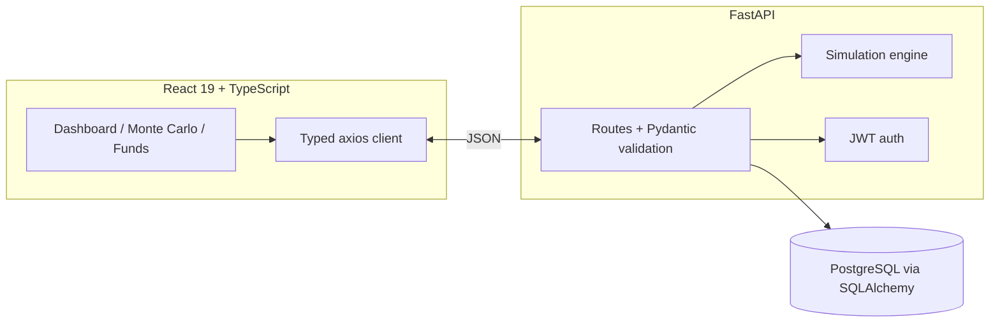

# SIP Friction Analyzer

[](LICENSE)

A web app that shows what skipping or reducing SIP contributions actually costs over a couple of
decades. You set up a monthly plan, add the things that go wrong in real life — a six-month pause, a
year at half the amount, an annual step-up — and it compares that against the disciplined version.

Built with React and TypeScript on the front, FastAPI and PostgreSQL behind it.

---

## What it does

Most people who fall short of their projected returns don't do so because the market
underperformed. They pause during a drawdown, skip a month, or quietly halve the amount and never
put it back. This puts a number on that.

For a given plan it computes:

- **Compounding loss** — the gap between the ideal and actual final corpus
- **Contribution Compliance Rate** — how much of the intended money actually went in
- **Discipline Score** (0–100) — a single figure weighting missed contributions and the compounding
  cost they caused
- **A Monte Carlo range** — 1,000 randomised return paths, reported as P10 / P50 / P90

---

## Key features

- Add friction events: skip a month, reduce by a factor, pause a date range, or apply an annual step-up
- Year-by-year chart of ideal vs actual, with the gap shaded
- Saved history — every run is stored with the events that produced it, so it can be explained later
- JWT sign-in; each user only sees their own runs
- A reporting endpoint showing which kinds of friction cost that user the most
- Fund comparison screens over a small reference catalogue

---

## How it works



The simulation runs on the server. It used to be reimplemented in TypeScript in the browser too,
which meant the compounding loop and the scoring formula existed twice in two languages with
nothing keeping them in step — and nothing was ever saved. Now there is one implementation, and
every run is persisted with its events.

### The maths, briefly

**Contribution Compliance Rate** — actual contributions divided by intended, clamped to [0, 1].

**Compounding loss** — ideal final value minus actual, floored at zero.

**Discipline Score** — `100 − (40 × (1 − CCR) + 60 × loss_ratio)`, clamped to [0, 100]. Missed
contributions are weighted at 40% and the compounding damage they caused at 60%, because the
second is what actually hurts over twenty years.

**Monte Carlo** — draws a normally distributed return each month and floors portfolio value at
zero. Annual volatility is scaled to monthly by dividing by √12, not by 12; dividing by 12 would
badly understate month-to-month dispersion.

This is additive normal returns, not geometric Brownian motion — GBM uses lognormal returns, this
applies `(1 + N(μ, σ))` directly. The simpler model is enough for showing how outcomes spread, and
calling it GBM would be wrong.

---

## Technical highlights

- **React 19 + TypeScript** in strict mode, with an error boundary and a debounced fund search
- **FastAPI** with Pydantic v2 request validation and a lifespan startup handler
- **PostgreSQL + SQLAlchemy** — foreign keys, cascading deletes and CHECK constraints
- **JWT auth** on the history and reporting endpoints
- **One transaction per run** — the simulation and all of its event rows commit together or not at all
- **A composite index** on the history lookup, evaluated with `EXPLAIN ANALYZE`
  (plans in [`docs/index-evaluation.md`](docs/index-evaluation.md))
- **Tests** — 17 backend tests against a real database, plus TypeScript type-checking and jest

---

## Database

```
users ──1:N──> simulations ──1:N──> simulation_events
```

A user owns many simulations; a simulation owns the friction events that produced it. Both foreign
keys cascade on delete, so removing a user cleans up everything below them and leaves nothing
orphaned.

The events matter. Before this, they were sent to the API, used to build the contribution schedule,
and then thrown away — so a saved run could not be explained or re-run. Storing them makes a
historical run reproducible.

CHECK constraints mirror bounds the engine already enforces in code (discipline score 0–100, CCR
0–1, valid event types, a pause that cannot end before it starts). Having them in the database too
means a future change can't quietly write a score of 150.

---

## Setup

### Prerequisites

Python 3.10+, Node.js 20+, PostgreSQL 14+.

### 1. Database

```bash
psql -U postgres -c "CREATE ROLE sip_app LOGIN PASSWORD '<YOUR_PASSWORD>';"
psql -U postgres -c "CREATE DATABASE sip OWNER sip_app;"
```

Tables are created automatically the first time the backend starts.

### 2. Environment

```bash
cp .env.example .env
```

```
DATABASE_URL=postgresql+psycopg2://sip_app:<YOUR_PASSWORD>@localhost:5432/sip
SECRET_KEY=<GENERATE_A_SECRET_KEY>
DEFAULT_ADMIN_USER=admin
DEFAULT_ADMIN_PASSWORD=<CHOOSE_A_LOCAL_PASSWORD>
```

Generate a key with:

```bash
python -c "import secrets; print(secrets.token_urlsafe(32))"
```

`.env` is gitignored and should never be committed. If `SECRET_KEY` is unset the server generates a
random one per process, so tokens stop working on restart. If `DEFAULT_ADMIN_PASSWORD` is unset no
account is seeded and you won't be able to sign in.

### 3. Backend

```bash
python -m venv .venv
source .venv/bin/activate          # Windows: .\.venv\Scripts\Activate.ps1
pip install -r requirements.txt
uvicorn main:app --reload
```

API docs at `http://localhost:8000/docs`.

### 4. Frontend

```bash
cd frontend
npm install
npm run dev
```

App at `http://localhost:5173`. Sign in with the account seeded from `.env`.

---

## Tests

```bash
python -m pytest test_backend.py -q
```

17 tests against the configured PostgreSQL database. Each creates a uniquely named throwaway user
and deletes it afterwards, so they don't disturb existing data. They cover the transaction, the
cascade delete, auth enforcement, and that a search matching nothing returns an empty list.

```bash
cd frontend
npx tsc --noEmit
npm test
```

---

## Docker

The `Dockerfile` builds the frontend and serves it from the FastAPI app:

```bash
docker build -t sip-friction-analyzer .
docker run --rm -p 8000:8000 --env-file .env sip-friction-analyzer
```

The image hasn't been built or tested in my current environment — the local setup above is the
supported path.

---

## Limitations

- The return model is deliberately simple: a normally distributed monthly return with constant
  volatility. Real markets have fat tails, volatility clustering and serial correlation, none of
  which are modelled.
- Fund data is a small hardcoded reference catalogue for exercising the UI. It is not live market
  data and the figures should not be used to pick anything.
- Everything is pre-tax and ignores expense ratios, exit loads and inflation.
- This is an educational simulator, not financial advice.

---

## Project structure

```text
sip-friction-analyzer/
├── .github/workflows/       # CI: lint, type-check, tests, build
├── docs/
│   └── index-evaluation.md  # EXPLAIN ANALYZE output for the history index
├── engine/
│   ├── simulation.py        # Compounding loop and Monte Carlo paths
│   └── friction.py          # CCR, compounding loss, discipline score
├── frontend/
│   └── src/
│       ├── components/      # UI primitives, layout, error boundary
│       ├── hooks/           # useDebounce
│       ├── pages/           # Login, Dashboard, MonteCarlo, FundExplorer, CompareFunds
│       ├── services/        # Typed axios layer and token handling
│       ├── types/           # Shared TypeScript interfaces
│       └── utils/           # Currency formatting
├── auth.py                  # Password hashing and JWT
├── config.py                # Settings loaded from .env
├── database.py              # SQLAlchemy engine and session
├── main.py                  # FastAPI app and routes
├── models.py                # Tables, foreign keys, constraints
├── reset_db.py              # Drops and recreates the fund table
├── test_backend.py          # Backend tests
├── requirements.txt
└── Dockerfile
```

---

## License

[MIT](LICENSE)
