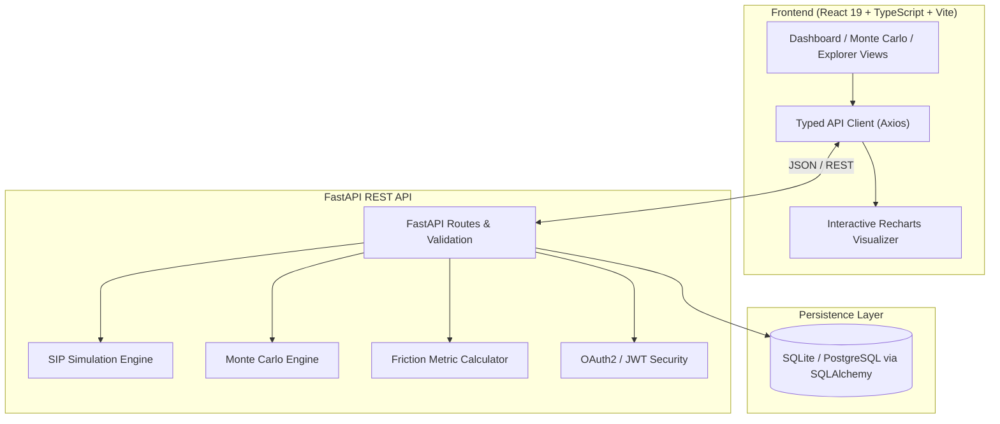

# 📈 SIP Friction Analyzer

[](https://fastapi.tiangolo.com)
[](https://react.dev)
[](https://python.org)
[](LICENSE)

A web application that estimates how **skipped or reduced contributions** affect the long-term outcome of a Systematic Investment Plan (SIP).

---

## 💡 The Problem & Motivation

Most retail investors fail to achieve projected compound returns not due to market underperformance, but due to **behavioral friction**:
- Pausing contributions during market drawdowns
- Skipping monthly installments
- Prematurely reducing ticket sizes
- Failing to institute periodic step-ups

**SIP Friction Analyzer** models discrete cashflow perturbations against ideal compound trajectories, computing exact compounding loss and probabilistic terminal wealth via stochastic Monte Carlo simulation.

---

## 🏛️ System Architecture



---

## 🧠 Engineering Decisions & Architectural Trade-offs

1. **Cashflow Pre-Computation ($\mathcal{O}(T)$ vs $\mathcal{O}(N \times T)$)**:
   - *Problem*: Running 1,000–10,000 Monte Carlo paths with recurring annual step-ups and multiple discrete pause ranges was bottlenecked by evaluating event conditionals inside nested month loops.
   - *Solution*: Pre-compiled the cashflow schedule into an indexed array once in $\mathcal{O}(T)$ time before executing stochastic paths, so the event conditionals are evaluated once rather than inside the inner month loop.
   - *Note*: this was done to avoid redundant work, not on the basis of a benchmark. No timing comparison was measured, so no speedup figure is claimed.

2. **Square-Root Volatility Scaling**:
   - *Problem*: Naive stochastic simulators divide annualized volatility by 12 ($\sigma / 12$), which severely suppresses monthly return dispersion.
   - *Solution*: Implemented standard quantitative finance temporal scaling ($\sigma_{\text{month}} = \sigma_{\text{annual}} / \sqrt{12}$) with continuous quantile interpolation ($P10, P50, P90$) and non-negative capital floors.

3. **FastAPI Lifespan Context & Decoupled Configuration**:
   - Replaced deprecated startup events with modern `@asynccontextmanager` lifespans for database initialization, backed by Pydantic `BaseSettings` for seamless environment switching between SQLite (local development) and PostgreSQL (production).

4. **Strict TypeScript & Error Boundaries**:
   - Unified all frontend contracts into strict TypeScript interfaces, backed by dedicated custom hooks (`useDebounce`) and a top-level `ErrorBoundary` to gracefully handle unexpected visualization runtime shocks.

---

## 📐 Mathematical Formulation

### 1. Contribution Compliance Rate ($CCR$)
Quantifies the proportion of expected capital successfully deployed over the investment horizon:
$$CCR = \frac{\sum_{t=1}^{T} C^{\text{actual}}_t}{\sum_{t=1}^{T} C^{\text{expected}}_t}$$

### 2. Compounding Loss Due to Friction ($CL_f$)
Measures the absolute terminal opportunity cost caused by contribution disruptions:
$$CL_f = \max\left(0, V_{\text{ideal}}(T) - V_{\text{actual}}(T)\right)$$

### 3. Investor Discipline Score ($DS$)
A composite index ($0 \le DS \le 100$) penalizing cashflow disruptions (40% weight) and compound opportunity loss (60% weight):
$$DS = \max\left(0, \min\left(100, 100 - \left[40 \times (1 - CCR) + 60 \times \frac{CL_f}{V_{\text{ideal}}(T)}\right]\right)\right)$$

### 4. Stochastic Monte Carlo Engine
Draws a normally distributed return for each month and floors portfolio value at zero. Annual
volatility is scaled to monthly by dividing by $\sqrt{12}$ rather than by 12, which would
understate month-to-month dispersion.

This is **additive normal returns**, not geometric Brownian motion. GBM uses lognormal returns;
this applies $(1 + \mathcal{N}(\mu, \sigma))$ directly. The simpler model is enough for showing
how outcomes spread, and calling it GBM would be wrong.
$$\sigma_{\text{month}} = \frac{\sigma_{\text{annual}}}{\sqrt{12}}$$
$$V(t) = \max\left(0, \left(V(t-1) + C_t\right) \times \left(1 + \mathcal{N}\left(\mu_{\text{month}}, \sigma_{\text{month}}\right)\right)\right)$$

---

## ✨ Key Features

- **Dynamic Cashflow Scheduler**: Supports arbitrary discrete shocks (`SKIP`, `REDUCE`, `INCREASE`), continuous date ranges (`PAUSE_RANGE`), and annual percentage increments (`STEP_UP`).
- **Pre-Compiled Simulation Pipelines**: Cashflow arrays are compiled in $\mathcal{O}(T)$ time before executing $\mathcal{O}(N \times T)$ Monte Carlo passes.
- **TypeScript Frontend**: React client that type-checks cleanly under `tsc --noEmit` with `strict` enabled, custom hooks (`useDebounce`), and Recharts charts.
- **Mutual Fund Discovery & Comparison**: Search, filter, and compare mutual fund CAGR metrics and expense ratios with automated seed data.
- **FastAPI Backend**: lifespan startup handler, Pydantic v2 request validation, SQLAlchemy models created on startup via `create_all` (there are no migrations), and JWT authentication on the history and insights endpoints.

---

## 🚀 Quickstart

### Prerequisites
- **Python** 3.10+
- **Node.js** 20+ and npm
- **PostgreSQL** 14+ running locally

### 1. Database

Create a role and database. Choose your own password and use it consistently below.

```bash
psql -U postgres -c "CREATE ROLE sip_app LOGIN PASSWORD '<YOUR_PASSWORD>';"
psql -U postgres -c "CREATE DATABASE sip OWNER sip_app;"
```

Tables are created automatically the first time the backend starts.

### 2. Environment

```bash
cp .env.example .env
```

Then edit `.env`:

```
DATABASE_URL=postgresql+psycopg2://sip_app:<YOUR_PASSWORD>@localhost:5432/sip
SECRET_KEY=<GENERATE_A_SECRET_KEY>
DEFAULT_ADMIN_USER=admin
DEFAULT_ADMIN_PASSWORD=<CHOOSE_A_LOCAL_PASSWORD>
```

Generate a signing key with:

```bash
python -c "import secrets; print(secrets.token_urlsafe(32))"
```

`.env` is gitignored and must never be committed. If `SECRET_KEY` is left unset the server
generates a random one per process, so tokens stop working on restart. If
`DEFAULT_ADMIN_PASSWORD` is unset, no account is seeded and you will not be able to sign in.

### 3. Backend

```bash
git clone https://github.com/Anubhavkumarkanth/sip-friction-analyzer.git
cd sip-friction-analyzer

python -m venv .venv
source .venv/bin/activate          # Windows: .\.venv\Scripts\Activate.ps1

pip install -r requirements.txt
uvicorn main:app --reload --port 8000
```

API docs: **`http://localhost:8000/docs`**

### 4. Frontend

```bash
cd frontend
npm install
npm run dev
```

App: **`http://localhost:5173`** — sign in with the account seeded from `.env`.

---

## 🧪 Automated Testing

The backend tests run against the configured PostgreSQL database. They create a uniquely named
throwaway user per test and delete it afterwards, so they do not disturb existing data.

```bash
python -m pytest test_backend.py -q
```

```bash
cd frontend
npx tsc --noEmit
npm test
```

---

## 🐳 Docker

A multi-stage `Dockerfile` builds the frontend and serves it from the FastAPI app:

```bash
docker build -t sip-friction-analyzer .
docker run --rm -p 8000:8000 --env-file .env sip-friction-analyzer
```

Note: the image is provided as-is and has not been built or tested in the current environment.
The supported path is the local setup above.

---

## 📁 Project Structure

```text
sip-friction-analyzer/
├── .github/workflows/       # CI: lint, type-check, tests, build
├── docs/
│   └── index-evaluation.md  # EXPLAIN ANALYZE output for the history index
├── engine/
│   ├── simulation.py        # Compounding loop and Monte Carlo paths
│   └── friction.py          # CCR, compounding loss, discipline score
├── frontend/
│   └── src/
│       ├── components/      # UI primitives, layout, error boundary
│       ├── hooks/           # useDebounce
│       ├── pages/           # Login, Dashboard, MonteCarlo, FundExplorer, CompareFunds
│       ├── services/        # Typed axios layer and token handling
│       ├── types/           # Shared TypeScript interfaces
│       └── utils/           # Currency formatting
├── auth.py                  # Password hashing and JWT
├── config.py                # Settings loaded from .env
├── database.py              # SQLAlchemy engine and session
├── main.py                  # FastAPI app and routes
├── models.py                # Tables, foreign keys, constraints
├── reset_db.py              # Drops and recreates the fund table
├── test_backend.py          # Backend tests
├── requirements.txt
└── Dockerfile
```

---

## 📄 License

Distributed under the [MIT License](LICENSE).
